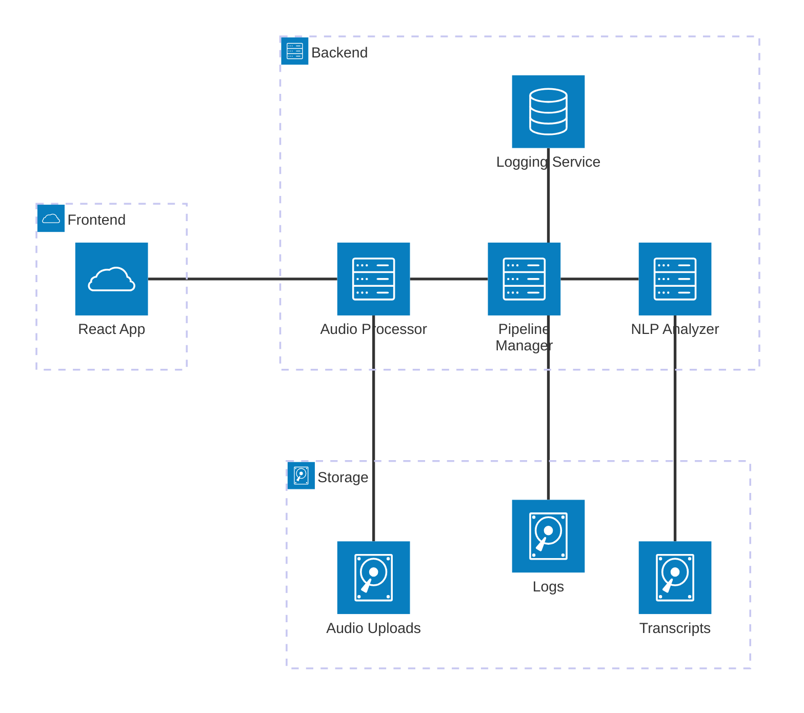

```mermaid
architecture-beta
    group backend(server)[Backend]
    group frontend(cloud)[Frontend]
    group storage(disk)[Storage]

    service audio_processor(server)[Audio Processor] in backend
    service nlp_analyzer(server)[NLP Analyzer] in backend
    service pipeline_manager(server)[Pipeline Manager] in backend
    service logging_service(database)[Logging Service] in backend

    service react_app(cloud)[React App] in frontend

    service audio_uploads(disk)[Audio Uploads] in storage
    service transcripts(disk)[Transcripts] in storage
    service logs(disk)[Logs] in storage

    react_app:R -- L:audio_processor
    audio_processor:R -- L:pipeline_manager
    pipeline_manager:R -- L:nlp_analyzer
    audio_processor:B -- T:audio_uploads
    nlp_analyzer:B -- T:transcripts
    logging_service:B -- T:logs
```
