# Why Diarization Needs a Separate Library

The core reason we need a separate library is that **Transcription** (What was said) and **Diarization** (Who said it) require two completely different "AI Brains".

## The Concept: "Two Different Brains"

1.  **Transcription Brain (Whisper):**
    *   **Goal:** Convert audio waves into words.
    *   **How it works:** It listens to phonetic sounds. It doesn't care about the *tone* or *identity* of the voice, only the *meaning*.
    *   **Analogy:** A court stenographer typing everything they hear, but with their eyes closed. They know *what* was said, but not *who* said it.

2.  **Diarization Brain (Pyannote):**
    *   **Goal:** Group similar-sounding voices together.
    *   **How it works:** It ignores the words entirely. It analyzes the "voice fingerprint" (pitch, timbre, accent) to say "Voice A spoke from 0:00 to 0:10" and "Voice B spoke from 0:10 to 0:20".
    *   **Analogy:** A security guard checking ID badges. They don't care what you are saying, only *who* you are.

## The Architecture

Because these are two different tasks, reliable systems run them as two parallel pipelines and then merge the results.

```mermaid
graph TD
    Audio[("🎤 Raw Audio File")]
    
    subgraph "Brain 1: Transcription (Whisper)"
        W[Whisper Engine]
        Text[("📄 Text Output\n'Hello world how are you'")]
    end
    
    subgraph "Brain 2: Diarization (Pyannote)"
        P[Diarization Engine]
        Embed[Voice Fingerprinting]
        Cluster[Clustering Similar Voices]
        Segments[("👥 Speaker Segments\nSpeaker A: 0:00-0:05\nSpeaker B: 0:05-0:10")]
    end
    
    Audio --> W
    W --> Text
    
    Audio --> P
    P --> Embed --> Cluster --> Segments
    
    Text --> Merger{Merge Engine}
    Segments --> Merger
    
    Merger --> Final[("✅ Final Transcript\n[Speaker A]: Hello world\n[Speaker B]: How are you")]
```

## Why `whisper.cpp` is different

The reason I suggested `whisper.cpp` (and its `tinydiarize` feature) is that it tries to "hack" this separation.

*   **The Hack:** They finetuned a Whisper model to predict "Speaker Change" as if it were a special word.
*   **Result:** It essentially tries to do both jobs with one brain.
*   **Trade-off:** It is much faster (1 pass instead of 2) and requires no extra library, BUT it is generally less accurate than the "Two Brains" approach.

## Summary
*   **Standard Setup (`mlx-whisper`):** Only has Brain 1. Needs a second library for Brain 2.
*   **Proposed Setup (`whisper.cpp`):** Uses a modified Brain 1 that can do a basic version of Brain 2's job.
